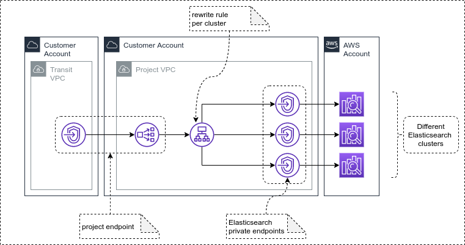

# elastic-ingress

this project has the objective of implementing the following topology:

in order to deploy it, you'll need the following pre-requisites:

- terraform
- pyhton 3.6+
- pip
- AWS's boto3 python library

for deploying the solution, follow these simple steps:

1. clone this repo
1. edit the file [variables.tf](variables.tf) for setting the right required values
1. execute a `terraform apply`
1. execute the python script [register_targets.py](register_targets.py)

while the terraform script will deploy the basic infrastructure, the python script will configure the target groups of both load balancers to the right ips, discovering the private endpoints of all Elasticsearch clusters deployed to the same account. 

In order to create the endpoint component on the transit VPC, use the 'service endpoint' output value of the terraform script. 